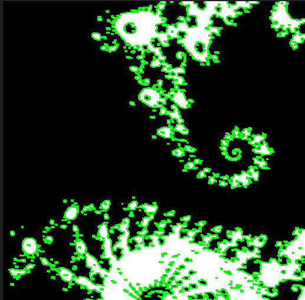

# Edge Detector

This project can load PGM files and perform an edge detection algorithm based on the minimization of an energy function as described in the "Method" section. It then exports this image in PGM format.

## Build and Run

Run `cmake -B build` and then use your preferred build system to compile.

To detect edges in an image, run `edge_detector path_to_config.txt path_to_input.pgm path_to_output.pgm`

## Method

This repository implements the method developed in "Active Contours Without Edges" (DOI: 10.1109/83.902291) by Tony F. Chan, Member, IEEE, and Luminita A. Vese.

## Example

Input|Output
-|-
|
 | 

## Parameters format

Format of the file containing the parameters

```
f epsilon = 0.2
f v = 0.0
f mu = 0.1
f lambda_1 = 1.2
f lambda_2 = 1.2
f tolerance = 5.0
f delta_t = 0.7
f eta = 0.1
i max_iter = 100
i log_iter = 1
```